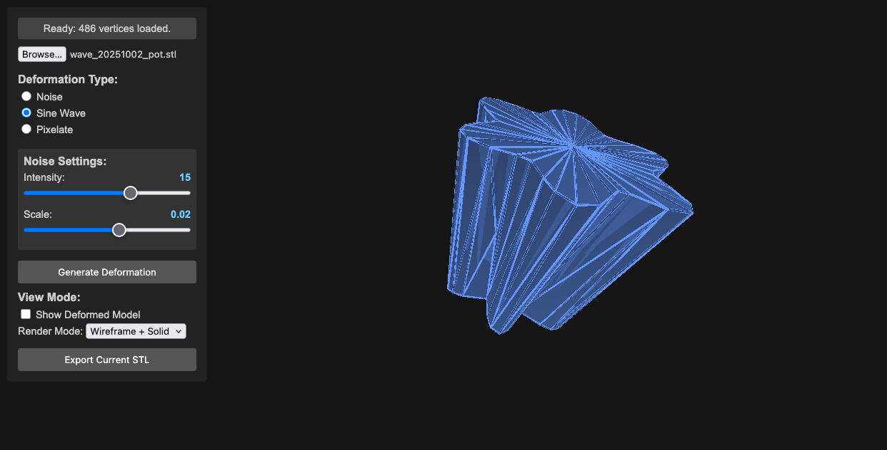
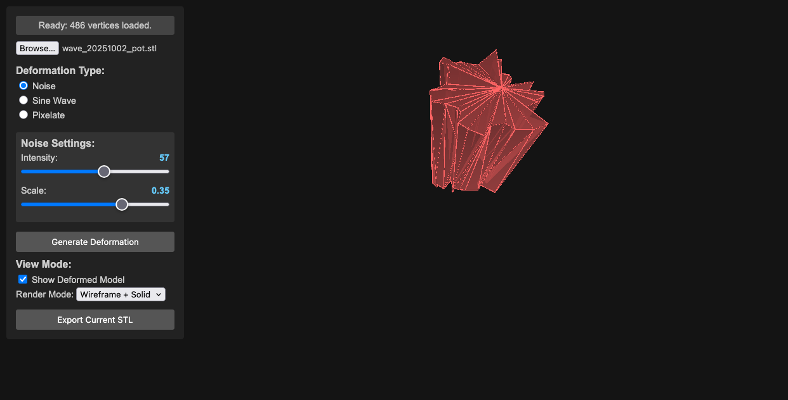
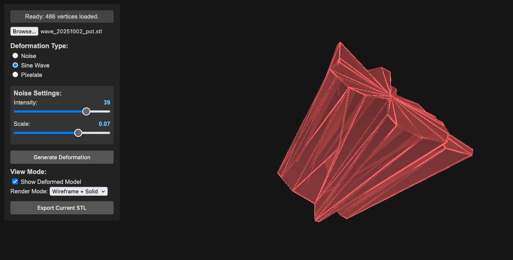
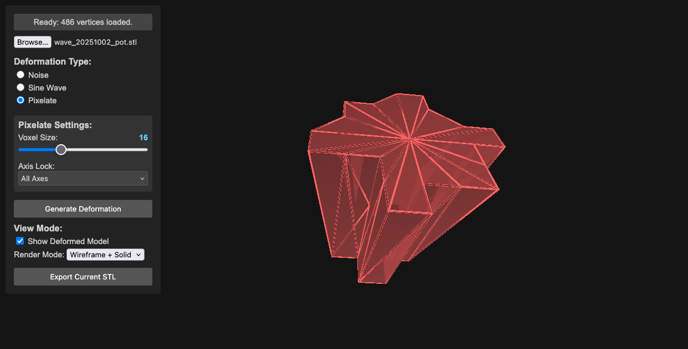

# STL Deformer Demo ~ Subversion of Form

This project demonstrates a real-time STL deformation tool using Three.js and p5.js. It allows you to load an STL file, apply various deformation effects (Noise, Sine Wave, Pixelate), and visualize the deformed model. It's a tool for pushing the boundaries of what you expect from a 3D model. The goal is to create subtly unsettling, oddly beautiful, and deliberately weird transformations of STL objects. Think of it as a digital sculpting playground.

Transform your 3D models into something unexpected, unsettling, and strangely beautiful. This experimental tool lets you push the boundaries of what's possible with STL files, creating deliberate distortions and abstract variations of your models. Think of it as a digital sculpture lab where mathematical chaos meets artistic expression.

## Motivation & Creative Exploration

- Subversion of Form: This project isn’t about perfect realism. It's about deliberately distorting the familiar, creating unsettling or intriguing shapes.
- Algorithmic Abstraction: Explore how mathematical functions (noise, sine waves) can be used to transform 3D geometry and change the practicality of 3d shapes.
- Visual Metaphors: Consider how different deformations might represent abstract concepts – chaos, tension, growth, decay.

  

## Features

- **STL Loading**: Loads STL files using the Three.js STLLoader. (Start with simple objects – boxes, spheres, basic shapes – to get the basics working).
- **Deformation Effects**:
  - **Noise**: Applies a noise-based deformation, introducing chaotic movement and distortion.
  - **Sine Wave**: Generates a sinusoidal wave deformation, producing rhythmic, flowing changes – potentially creating mesmerizing, pulsating effects.
  - **Pixelate**: Pixelates the model by snapping vertices to a grid, offering a stark, fragmented aesthetic.
- **Real-time Deformation**: Updates the deformation in real-time, allowing for interactive experimentation.
- **Parameter Controls**: Interactive sliders and checkboxes for adjusting deformation parameters.
- **Visual Feedback**: Displays the deformed model in 3D space.
- **Export**: Exports the deformed model as an STL file – save your weird creations!

## Deformation Examples

  
   <em>Noise Deformation</em>

  
   <em>Sine Wave Deformation</em>

  
   <em>Pixelated Deformation</em>

## Requirements

*   **Web Browser:**  A modern web browser (Chrome, Firefox, Safari, Edge)
*   **JavaScript:**  Supported by your browser
*   **Three.js:** Version 128 or later.  This project uses Three.js for 3D rendering.
*   **p5.js:** Version 1.7.0 or later.  Used for the control panel and UI elements.
*   **FileSaver.js:** (Included) For exporting the STL file.

## Setup

1.  **Files:**  The project consists of `index.html`, `sketch.js`, and the required JavaScript libraries.
2.  **Import:**  Place all files in a directory.
3.  **Run:**  Open `index.html` in your web browser.

## Usage

1.  **Load STL:**  Click the "File Input" button to select an STL file.
2.  **Deformation Type:** Choose the deformation type from the radio buttons (Noise, Sine Wave, Pixelate).
3.  **Adjust Parameters:** Use the sliders and checkboxes to control the deformation parameters.
4.  **Generate Deformation:** Click the "Generate Deformation" button.
5.  **Visualize:** The deformed model will be displayed in the 3D view.
6.  **Export (Optional):**  Click the "Export Current STL" button to save the deformed model as an STL file.

## Controls

*   **File Input:** Select an STL file.
*   **Radio Buttons:** Choose the deformation effect.
*   **Sliders:** Adjust the parameters of the chosen effect.
*   **Generate Deformation:** Apply the deformation.
*   **Export Current STL:** Export the deformed model.

## Code Structure

*   **`index.html`:**  The main HTML file that sets up the Three.js scene, UI elements, and event listeners.
*   **`sketch.js`:**  Contains the core logic for loading the STL, applying the deformation, rendering the model, and handling user interactions.  This file implements the Three.js scene, the custom camera, and the deformation algorithms.

## Notes

*   This is a basic demonstration and can be extended with more advanced features.
*   The performance of the deformation can depend on the complexity of the STL model and the chosen deformation algorithm.

## Contributing

Feel free to contribute to this project!  You can submit bug reports, feature requests, or pull requests.

## License

MIT License

