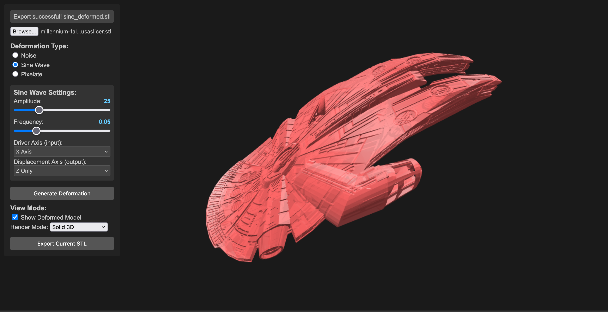
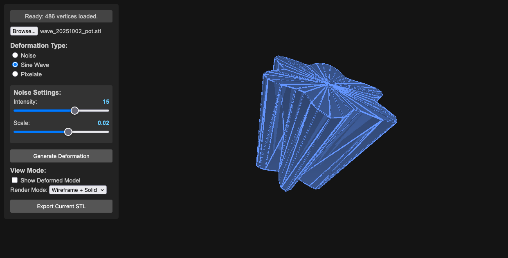
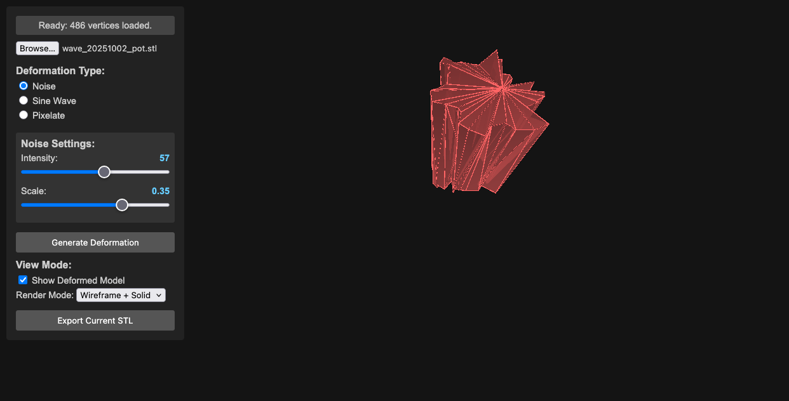
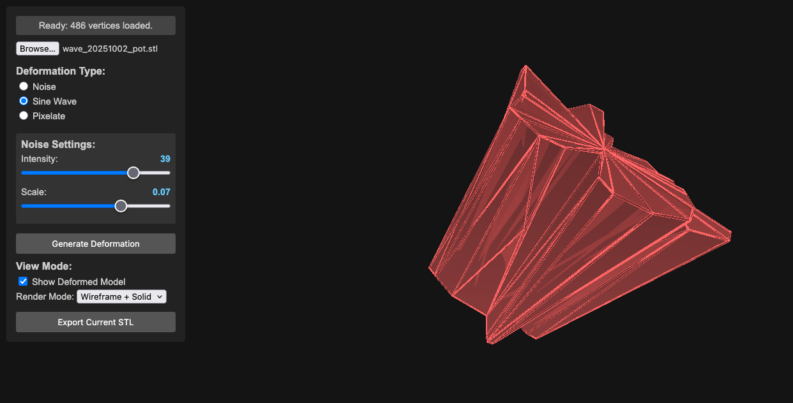
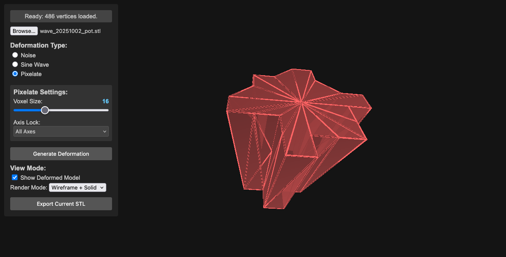

{fig-align="center" width="800"}

::: callout-note
This project is under constant development.
:::

This project demonstrates a real-time STL deformation tool using Three.js. It allows you to load an STL file, apply various deformation effects (Noise, Sine Wave, Pixelate, IDW Shepard, Perspective Distortion, plus advanced and topology-altering methods), and visualize the deformed model. It's a tool for pushing the boundaries of what you expect from a 3D model. The goal is to create subtly unsettling, oddly beautiful, and deliberately weird transformations of STL objects. Think of it as a digital sculpting playground.

::: callout-tip
Transform your 3D models into something unexpected, unsettling, and strangely beautiful. This experimental tool lets you push the boundaries of what's possible with STL files, creating deliberate distortions and abstract variations of your models. Think of it as a digital sculpture lab where mathematical chaos meets artistic expression.
:::

## Motivation & Creative Exploration

-   Subversion of Form: This project isn't about perfect realism. It's about deliberately distorting the familiar, creating unsettling or intriguing shapes.
-   Algorithmic Abstraction: Explore how mathematical functions (noise, sine waves, inverse distance weighting) can be used to transform 3D geometry and change the practicality of 3d shapes.
-   Visual Metaphors: Consider how different deformations might represent abstract concepts – chaos, tension, growth, decay.

## Features

-   **STL Loading**: Loads STL files using the Three.js STLLoader. (Start with simple objects – boxes, spheres, basic shapes – to get the basics working).
-   **Deformation Effects**:
    -   **Noise**: Applies a noise-based deformation, introducing chaotic movement and distortion.
    -   **Sine Wave**: Generates a sinusoidal wave deformation, producing rhythmic, flowing changes – potentially creating mesmerizing, pulsating effects.
    -   **Pixelate**: Pixelates the model by snapping vertices to a grid, offering a stark, fragmented aesthetic.
    -   **IDW Shepard**: Advanced organic deformation using multiple control points distributed throughout the model's volume via Poisson disk sampling.
    -   **Inflate / Twist / Bend / Ripple / Warp / Hyperbolic Stretch**: A suite of expressive surface operators. Inflate swells outward by distance from center, Twist rotates along a chosen axis, Bend arcs the mesh over a controllable range, Ripple adds wave-like undulation, Warp introduces spatial noise-based offsets, and Hyperbolic Stretch exaggerates form along an axis for elastic, pulled silhouettes.
    -   **Perspective Distortion**: Projects geometry through a configurable vanishing point. An interactive canvas widget lets you drag a dot to set the distortion direction; the center means no effect. Supports 1-point and 2-point modes (second orange dot adds an independent vanishing point), a plane selector (XY / XZ / YZ) to map widget axes to model space, linear and exponential falloff modes, and touch input on mobile.
    -   **Tessellate / Boundary Disruption / Menger Sponge**: Topology-oriented transformations. Tessellate subdivides triangles to add geometric density, Boundary Disruption jitters near edges for torn or frayed contours, and Menger Sponge carves repeating voids for porous, lattice-like structures.
-   **Real-time Deformation**: Updates the deformation in real-time, allowing for interactive experimentation.
-   **Parameter Controls**: Interactive sliders and checkboxes for adjusting deformation parameters.
-   **Adaptive Parameter Ranges**: Parameters automatically scale based on model size to ensure consistent effects across different STL scales.
-   **Visual Feedback**: Displays the deformed model in 3D space with control point visualization for IDW deformation.
-   **Axis Gizmo**: On-screen X/Y/Z labels for orientation.
-   **Multi-Axis Selection**: Axis-based deformations (twist, bend, ripple, hyper) can target multiple axes.
-   **Parallel Processing**: Uses Web Workers for efficient processing of large STL files with thousands of vertices.
-   **Preprocess Options**: Optional cleanup before deformation. Decimate keeps a percentage of triangles (faster but less detail), and Vertex Merge collapses near-identical vertices within an epsilon (reduces duplicates and can stabilize deformations). Not required for most models, but helpful for very dense STLs or when you need faster iteration.
-   **Import/Export Settings**: Reuse deformation presets across STLs; exported settings include preprocess parameters.
-   **Stats HUD**: Displays vertex/triangle counts and deformation time.
-   **Export**: Exports the deformed model as an STL file – save your weird creations!

## Deformation Examples

{fig-align="center" width="800"}

{fig-align="center" width="800"}

{fig-align="center" width="800"}

{fig-align="center" width="800"}

 <em>Pixelated Deformation</em>

## IDW Shepard Deformation

The IDW (Inverse Distance Weighting) Shepard deformation represents a significant advancement in organic 3D manipulation. Unlike traditional single-point deformations, this method uses multiple control points strategically placed throughout the model's interior volume.

### Key Features

-   **Poisson Disk Sampling**: Evenly distributed control points to prevent clustering
-   **Volume-Constrained Placement**: Points are guaranteed inside the mesh volume
-   **Seed-Based Generation**: Deterministic point placement for reproducible results
-   **Manual Control Points**: Optional manual list of points (single or multi-point)
-   **Sampling Rays Control**: Adjustable inside-mesh sampling for speed/robustness
-   **Adaptive Influence**: Inverse distance weighting with customizable power falloff
-   **Visual Feedback**: Wireframe spheres show control point positions and influence
-   **Scalable Effects**: Parameter ranges scale to model size for consistent output

### Technical Implementation

-   **Multi-Point IDW**: Each vertex is influenced by all control points
-   **Parallel Processing**: Web Workers handle heavy computation for large meshes
-   **Real-time Visualization**: Control points scale with model size (5% of largest dimension)
-   **Robust Volume Detection**: Advanced ray casting ensures points are truly inside the mesh

## Perspective Distortion

Perspective Distortion simulates the geometric projection of a vanishing point applied directly to mesh vertices — not a camera trick, but an actual vertex transformation.

### Key Features

-   **Interactive canvas widget**: Drag a dot inside a circle; dot position = stretch direction, center = no effect
-   **1-point mode**: Single vanishing point for classic perspective exaggeration
-   **2-point mode**: Second orange dot adds an independent vanishing point for complex projections
-   **Plane selector**: XY / XZ / YZ maps the 2D widget axes to the correct model-space plane
-   **Falloff modes**: Linear (uniform gradient) or Exponential (strong near vanishing point, soft far away)
-   **Touch support**: Works on mobile and tablet

## Requirements

-   Modern web browser with Web Worker support (Chrome 4+, Firefox 3.5+, Safari 4+, Edge)
-   JavaScript ES6+ features supported by your browser
-   Three.js r121 (bundled)
-   FileSaver.js (included)
-   Web Workers (required for parallel processing of large deformations)

## Run Options

1.  **Run locally:** Clone the repository and open `index.html` in a modern browser.
2.  **Run online:** Open the hosted version at [https://toledoem.github.io/stlshaper/](https://toledoem.github.io/stlshaper/).

## Setup

1.  Place all files (`index.html`, `main.js`, libraries) in a directory.
2.  Open `index.html` in your web browser.

## Usage

1.  **Load STL:** Click the "File Input" button to select an STL file.
2.  **Deformation Type:** Choose the deformation type from the radio buttons (Noise, Sine Wave, Pixelate, IDW Shepard, etc.).
3.  **Adjust Parameters:** Use the sliders and inputs to control the deformation parameters. IDW parameters adapt automatically to model size.
4.  **Generate Deformation:** Click the "Generate Deformation" button.
5.  **Visualize:** The deformed model will be displayed in the 3D view.
6.  **Export (Optional):** Click the "Export Current STL" button to save the deformed model as an STL file.

## Controls

-   **File Input:** Select an STL file.
-   **Radio Buttons:** Choose the deformation effect.
-   **Sliders:** Adjust the parameters of the chosen effect.

### Noise Controls

-   **Intensity:** Controls the strength of the noise deformation (0.1 - 5.0)
-   **Scale:** Controls the frequency/size of noise features (0.005 - 0.5)
-   **Axis:** Choose which axes to apply noise to (All, X, Y, Z, or combinations)

### Sine Wave Controls

-   **Amplitude:** Controls the height of the sine waves (1 - 100)
-   **Frequency:** Controls how many waves fit in the model (0.01 - 0.2)
-   **Driver Axis:** Which axis provides the input to the sine function (X, Y, Z)
-   **Displacement Axis:** Which axes the sine wave displaces (X, Y, Z, or combinations)

### Pixelate Controls

-   **Voxel Size:** Size of the pixelation grid (0.5 - 50)
-   **Axis Lock:** Which axes to pixelate (All, X, Y, Z, or combinations)

### IDW Shepard Controls

-   **Number of Points:** How many control points to generate (3 - 50)
-   **Seed:** Numeric seed for reproducible control point placement (0 - 10000)
-   **Weight:** Strength of attraction/repulsion at control points (adaptive range by model size)
-   **Power:** Influence falloff with distance (0.5 - 6.0)
-   **Global Scale:** Overall deformation scaling (adaptive range by model size)
-   **Generate Deformation:** Apply the deformation.
-   **Export Current STL:** Export the deformed model.

### Perspective Distortion Controls

-   **Canvas widget:** Drag dot to set vanishing point direction and magnitude
-   **Mode:** 1-point or 2-point
-   **Plane:** XY / XZ / YZ
-   **Strength:** Overall distortion magnitude
-   **Falloff:** Linear or Exponential

## Code Structure

-   **`index.html`:** The main HTML file that sets up the Three.js scene, UI elements, and event listeners.
-   **`main.js`:** Core logic for loading the STL, applying deformation, rendering, and UI. Includes Poisson disk sampling, volume detection, and adaptive parameter scaling.
-   **`worker.js`:** Web Worker for parallel processing of vertex deformations (especially IDW).
-   **`libraries/`:** Three.js, FileSaver.js, and other required libraries.

## Important Notes

::: callout-warning
## Performance Considerations

-   The performance depends on the complexity of the STL model and chosen deformation algorithm
-   The rendering process can be slow with complex models
-   Web Workers improve responsiveness for large meshes and multi-point IDW
:::

::: callout-important
## Post-processing Required

After deformation, process the model in Meshlab using these filters:

1.  Filters -\> Cleaning and Repairing
2.  Remove Zero Area Faces (twice)
3.  Repair Non-manifold Edges (split)
:::

::: callout-note
This is a basic demonstration that can be extended with more advanced features.
:::

## Notes

-   IDW Shepard deformation works best with solid, manifold meshes. Complex or thin-walled models may produce unexpected results.
-   Some STLs may require normal regeneration to avoid black/incorrect shading (handled in recent builds).

## Changelog

### 0.7.0 (2026-04-21)

-   Added Perspective Distortion deformation with interactive vanishing-point picker widget
-   Circle canvas widget with draggable dot to set distortion direction; center = no effect
-   1-point and 2-point mode: second orange dot adds independent vanishing point
-   Plane selector (XY / XZ / YZ) maps widget axes to model space
-   Linear and exponential falloff modes
-   Touch support for the canvas widget

### 0.6.0 (2026-02-10)

-   Added importable deformation settings to reuse presets across STLs
-   Added on-screen axis gizmo with X/Y/Z labels
-   Added multi-axis selection for axis-based deformations (twist, bend, ripple, hyper)
-   Improved Menger sponge, tessellation range, settings export, and UI/camera performance
-   Fixed shading issues by ensuring valid vertex normals, plus assorted robustness fixes

### 0.5.0 (2026-02-08)

-   Updated GUI and camera behavior
-   Fixed P0, P1, P3, and P4 issue sets

### 0.4.0 (2025-10-28)

-   Added settings workflow groundwork and Web Worker processing
-   General refinements and cleanup

### 0.3.0 (2025-10-27)

-   Initial autoloader workflow

### 0.2.0 (2025-10-06)

-   Bug fixes and iterative improvements

### 0.1.0 (2025-10-04)

-   Initial project scaffold and documentation

## Contributing

Feel free to contribute to this project! You can:

-   Submit bug reports
-   Suggest feature requests
-   Create pull requests

## License

This project is licensed under the MIT License.
